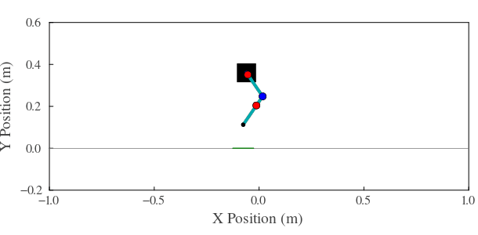

# Modeling, Simulation, and Experimental Testing of a Single-legged Hopper
The following repository contains the MATLAB and Simulink files that establish an accurate mathematical model for a vertical hopping robot.Modeling, Simulation, and Experimental Testing of a Single-legged Hopper

[]

## Modeling
Detail the modeling aspect of your project. Describe the methods, tools, and processes you used to develop the model.

Link to the relevant files and documentation for the modeling section.
- [Modeling Flight](Modeling/Modeling%20Software/SymPy%20DP%20Derivation2.0.jl)
- [Modeling Stance](Modeling/Modeling%20Software/SymPy%20DP%20Ground%20wSensor%20Derivation3.0.jl)
- [Modeling Inverted Pendulum](Modeling/Modeling%20Software/Inverted%20Pendulum%20Derivation.jl)
- [Modeling Triple Inverted Pendulum](Modeling/Modeling%20Software/SymPy%20Triple%20Pendulum%20Derivation.jl)

Include an image or animation that visually represents your model.

## Simulation
Explain the simulation processes, tools, and techniques you used. Provide context on what the simulations aim to achieve.

Link to the relevant files and documentation for the simulation section.
- [Simulation Code](path/to/simulation_code)
- [Simulation Documentation](path/to/simulation_documentation)

Include an image or animation that illustrates the simulation results or process .

## Experimental Testing
Describe the experimental testing procedures, including the setup, methodology, and equipment used. Highlight key results and findings.

Link to the relevant files and documentation for the experimental testing section.
- [Experimental Testing Code](path/to/experimental_testing_code)
- [Experimental Testing Documentation](path/to/experimental_testing_documentation)

Include an image or animation related to the experimental testing.

