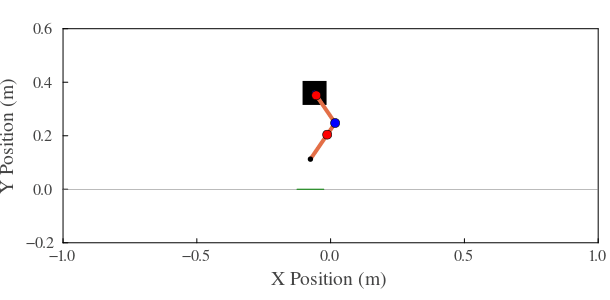
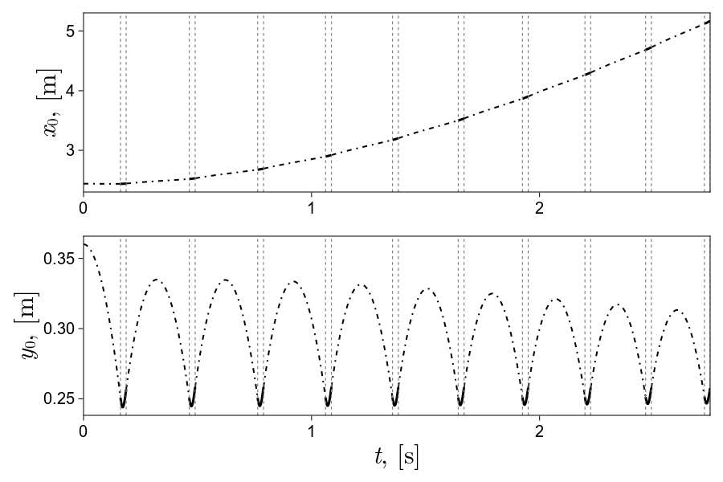

# Modeling, Simulation, and Experimental Testing of a Single-legged Hopper
The following repository contains the Julia and Simulink files used in developing a physical single-legged forward hopper. The details in developing stable hopping for the single leg begins with modeling the dynamics, then simulation to develop a controller, and finally experimental testing to implement what was learned from the simulation and modeling to achieve stable forward hopping. This repository contains all the code developed for this project.

  

## Modeling
A generic modeling method utilizing the Euler-Lagrange method derives the equations of motion in julia and saves the results to text files. This method is used to derive a variety of energy based systems. To establishe a symbolic mathematical model for the single leg's dynamics, The model of the leg is defined in two parts: the dynamics of flight and the dynamics of stance. 

Links to Julia derevation code.
- [Modeling Flight](Modeling/Modeling%20Software/SymPy%20DP%20Derivation2.0.jl)
- [Modeling Stance](Modeling/Modeling%20Software/SymPy%20DP%20Ground%20wSensor%20Derivation3.0.jl)
- [Modeling Inverted Pendulum](Modeling/Modeling%20Software/Inverted%20Pendulum%20Derivation.jl)
- [Modeling Triple Inverted Pendulum](Modeling/Modeling%20Software/SymPy%20Triple%20Pendulum%20Derivation.jl)

Links to derevation text files. The Equasions are written to be easily copied and pasted into code.
- [Flight Equasion](Modeling/Model%20Equasions/Flight.txt) for Julia
- [Stance Equasion](Modeling/Model%20Equasions/Stance.txt) for Julia
- Inverted Pendulum Equasion
  - [Generic Form](Modeling/Model%20Equasions/InvertedPendulum1.txt)
  - [For Matlab](Modeling/Model%20Equasions/InvertedPendulum2.txt)
- Triple Inverted Pendulum Equasion
  - [Generic Form](Modeling/Model%20Equasions/TripleInvertedPendulum1.txt)
  - [For Matlab](Modeling/Model%20Equasions/TripleInvertedPendulum2.txt)

## Simulation
Simulation defines the control methodology for achieving single leg forward hopping. From analyzing the results the controller's performance is optiomized to achieve the desired preformance. The code is brocken into three parts: a function file containing all necessary functions for control and analysis, simulation files, and analysis files.

[Function File](Simulation/Simulation%20Software/MyRobotFunctionPackage/src/MyRobotFunctionPackage5.jl)

Simulation Code
- [Combined](Simulation/Simulation%20Software/Double%20Pendulum%20Combined9.0.jl): This Simulates the total response of the leg in both phases repeatedly
- [Flight](Simulation/Simulation%20Software/Flight%20Double%20Pendulum%208.0.jl): Simulates just during flight
- [Stance](Simulation/Simulation%20Software/Stance%20Double%20Pendulum%208.0.jl): Simulates just during stance

  

**
Animation of the Combined Simulation
**

Simulation Analysis Files
- [Modeling Flight](Modeling/Modeling%20Software/SymPy%20DP%20Derivation2.0.jl)
- [Modeling Stance](Modeling/Modeling%20Software/SymPy%20DP%20Ground%20wSensor%20Derivation3.0.jl)
- [Modeling Inverted Pendulum](Modeling/Modeling%20Software/Inverted%20Pendulum%20Derivation.jl)
- [Modeling Triple Inverted Pendulum](Modeling/Modeling%20Software/SymPy%20Triple%20Pendulum%20Derivation.jl)

  

**
Hip Position Transiant Response
**

## Experimental Testing
Describe the experimental testing procedures, including the setup, methodology, and equipment used. Highlight key results and findings.

Link to the relevant files and documentation for the experimental testing section.
- [Experimental Testing Code](path/to/experimental_testing_code)
- [Experimental Testing Documentation](path/to/experimental_testing_documentation)

Include an image or animation related to the experimental testing.

