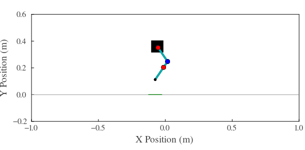
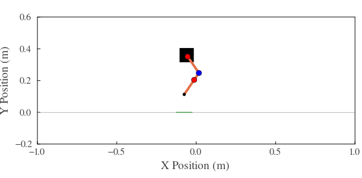
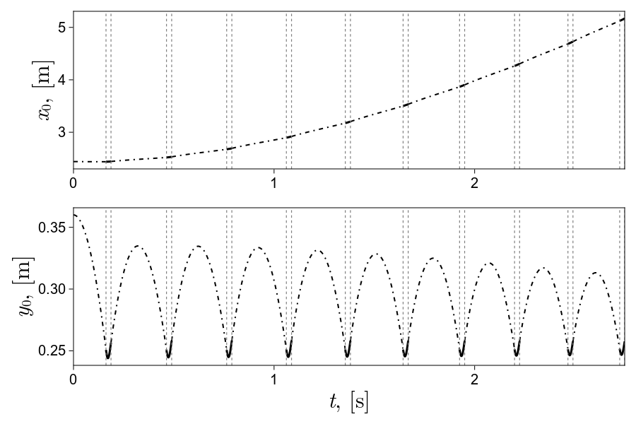

# Modeling, Simulation, and Experimental Testing of a Single-legged Hopper
The following repository contains the Julia and Simulink files used in developing a physical single-legged forward hopper. The details in developing stable hopping for the single leg begins with modeling the dynamics, then simulation to develop a controller, and finally experimental testing to implement what was learned from the simulation and modeling to achieve stable forward hopping. This repository contains all the code developed for this project.

  

## Modeling
A generic modeling method utilizing the Euler-Lagrange method derives the equations of motion in julia and saves the results to text files. This method is used to derive a variety of energy based systems. To establish a symbolic mathematical model for the single leg's dynamics, The model of the leg is defined in two parts: the dynamics of flight and the dynamics of stance. 

Links to Julia derivation code.
- [Modeling Flight](Modeling/Modeling%20Software/SymPy%20DP%20Derivation2.0.jl)
- [Modeling Stance](Modeling/Modeling%20Software/SymPy%20DP%20Ground%20wSensor%20Derivation3.0.jl)
- [Modeling Inverted Pendulum](Modeling/Modeling%20Software/Inverted%20Pendulum%20Derivation.jl)
- [Modeling Triple Inverted Pendulum](Modeling/Modeling%20Software/SymPy%20Triple%20Pendulum%20Derivation.jl)

Links to derivation text files. The Equations are written to be easily copied and pasted into code.
- [Flight Equation](Modeling/Model%20Equasions/Flight.txt)
- [Stance Equation](Modeling/Model%20Equasions/Stance.txt)
- Inverted Pendulum Equation
  - [Generic Form](Modeling/Model%20Equasions/InvertedPendulum1.txt)
  - [For Matlab](Modeling/Model%20Equasions/InvertedPendulum2.txt)
- Triple Inverted Pendulum Equation
  - [Generic Form](Modeling/Model%20Equasions/TripleInvertedPendulum1.txt)
  - [For Matlab](Modeling/Model%20Equasions/TripleInvertedPendulum2.txt)

## Simulation
Simulation defines the control methodology for achieving single leg forward hopping. From analyzing the results the controller's performance is optimized to achieve the desired performance. The code is broken into three parts: a function file containing all necessary functions for control and analysis, simulation files, and analysis files.

[Function File](Simulation/Simulation%20Software/MyRobotFunctionPackage/src/MyRobotFunctionPackage5.jl)

Simulation Code
- [Combined](Simulation/Simulation%20Software/Double%20Pendulum%20Combined9.0.jl): This Simulates the total response of the leg in both phases repeatedly
- [Flight](Simulation/Simulation%20Software/Flight%20Double%20Pendulum%208.0.jl): Simulates just during flight
- [Stance](Simulation/Simulation%20Software/Stance%20Double%20Pendulum%208.0.jl): Simulates just during stance
- Parameter Sweep: Simulates multiple “Combined” simulations with an array of values for key parameters. Used in achieving a desired performance and graphing the result of changing inputs
  - [Tuning Px](Simulation/Simulation%20Software/Double%20Pendulum%20Goal%20Tuning%20Px%201.0.jl)
  - [Tuning α](Simulation/Simulation%20Software/Double%20Pendulum%20Goal%20Tuning%20Offset%201.0.jl)

  

**
Animation of the Combined Simulation
**

Simulation Analysis Files
- Plotting: Uses simulation data to plot key variables during a simulation.
  - [Plot eps](Simulation/Simulation%20Software/Double%20Pendulum%20XLSX%20Plotter%206.0.jl)
  - [Plot png](Simulation/Simulation%20Software/Double%20Pendulum%20XLSX%20Plotter%207.0.jl)
- [Create Animation](Simulation/Simulation%20Software/Double%20Pendulum%20XLSX%20Animator%202.0.jl): Uses simulation data to visualize system performance
  - [Overlay Animations](Simulation/Simulation%20Software/Double%20Pendulum%20XLSX%20Animator%203.0.jl): Uses multiple datasets to compare several systems performance
- [Parameter Sweep Plot](Simulation/Simulation%20Software/Sim%20Goal%20XLSX%20Plotter%201.0.jl): Using data from the parameter sweep simulation a plot can be created comparing a parameter and the resulting horizontal speed.

  

**
Simulation Hip Position Transient Response
**

## Experimental Testing
The experimental testing implements the mathematical model and simulations into controlling a real-world hopping robot leg. The software architecture is built in Simulink and runs on the Speedgoat. This enables real-time data exchange between the hardware and Simulink controller. After a test is performed Simulink allows easy data exporting to excel.

Experimental Software
- [Encoder Testing Code](Experimental%20Testing/Experimental%20Software/EncoderTest01.slx): Operate just the encoders. Good for testing and calibrating.
- [Stabilize Tuning Software](Experimental%20Testing/Experimental%20Software/PlanerizerTest09_Flight_Stance.slx): Experimental software used in the majority of the testing.
- [Hop-speed Tuning Software](Experimental%20Testing/Experimental%20Software/PlanerizerTest12_Flight_Stance.slx): The most up to date version of the experimental software. Used in performing many tests while being able to tune key parameters for adjusting hop speed.

  

Experimental Data Analysis
- [Plotting](Simulation/Simulation%20Software/Double%20Pendulum%20XLSX%20EXP%20Plotter%202.0.jl): Graphs experimental data as a .jpg and .eps.
- [Parameter Sweep Plot](Simulation/Simulation%20Software/Sim%20Goal%20XLSX%20EXP%20Plotter%201.0.jl): Plots data used for tuning horizontal speed, similar to the simulation parameter sweep plot.

  

**
Experimental Hip Position Transient Response
**
